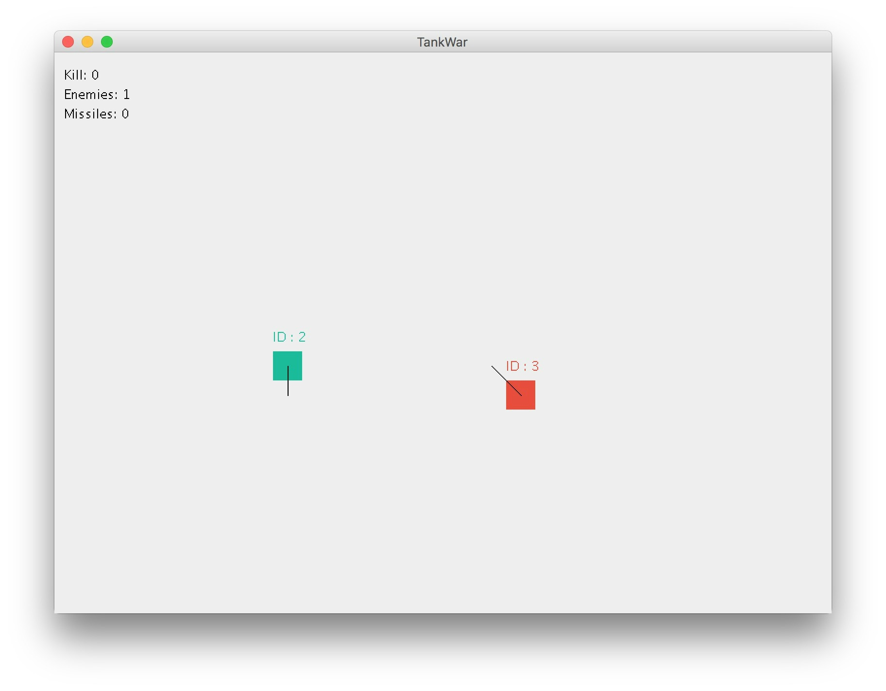

# TankWorld
A simple online game

### Preview

### How to play

1. Make sure port `65432` on the host is not occupied before running `TankServer`, otherwise you need to change `UDP_SERVER_PORT` in `TankServer.java` into other unused port number.

2. Run `TankClient`, press `C` key and enter the host IP, the default IP `127.0.0.1` is your localhost IP.

3. Share `TankClient` with your friends and enjoy fun of the game.
